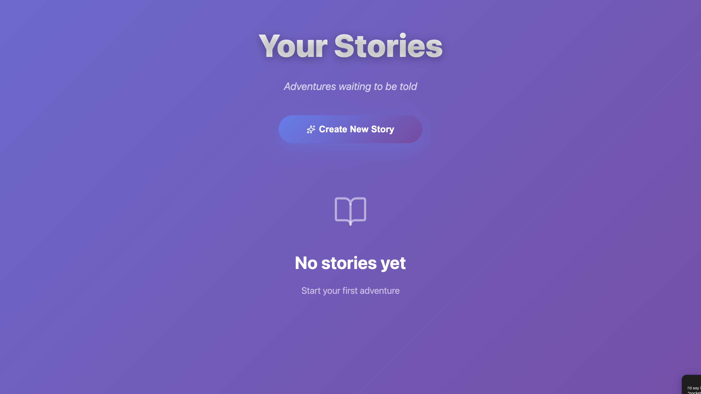
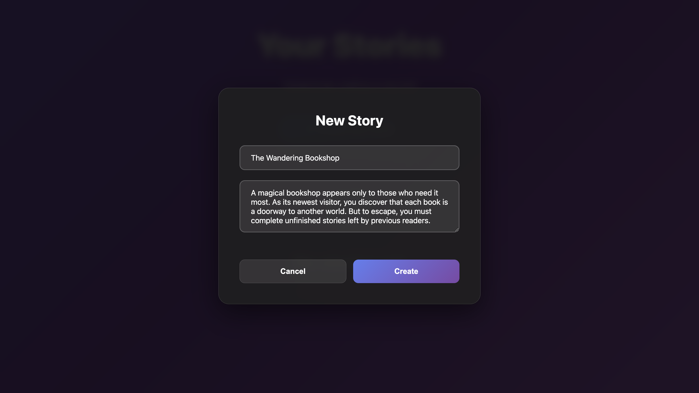
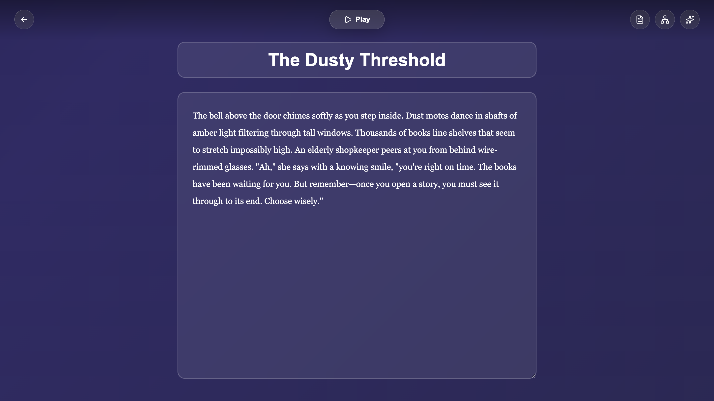
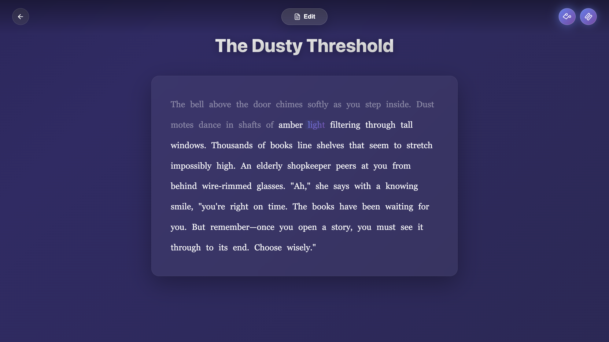

# StoryWeaver AI Story Editor


> **Full-stack interactive story editor with AI-powered scene generation and immersive narration features**

A modern web application showcasing full-stack development skills, AI API integration, and advanced UX design. This portfolio project demonstrates the implementation of a complete interactive storytelling platform with branching narratives, real-time AI assistance, and immersive audio-visual features.

---

## 📸 Screenshots & Demo

### Application Screenshots

**Homepage - Story Library**

*Clean, intuitive homepage with gradient design - ready for your creative adventures*

**Create New Story**

*Story creation modal with title and description fields for setting up your narrative*

**Scene Editor**

*Inline scene editing with real-time preview - craft your story scenes with ease*

**Play Mode**

*Immersive reading experience with glassmorphism UI and smooth animations*

### Demo Video

📹 **[Watch 2-minute demo video](https://github.com/user-attachments/assets/4a19746e-932d-463c-a79d-1ee2968ae64f)**

The demo showcases:
- Creating interactive branching stories
- AI-powered scene generation and suggestions
- Text-to-speech narration with word highlighting
- Custom player input for dynamic story paths
- Seamless switching between edit and play modes
- Glassmorphism UI with smooth animations

---

## 📖 Overview

StoryWeaver is a sophisticated web application that enables creators to build branching interactive stories with intelligent assistance. The project demonstrates mastery of modern web technologies, complex state management for non-linear narratives, and seamless integration of AI capabilities through standard API patterns.

**Key Demonstration Areas:**
- Full-stack TypeScript architecture with clear separation of concerns
- Integration of external AI APIs for dynamic content generation
- Advanced browser API usage (Web Speech API, Web Audio API)
- Modern UI/UX with glassmorphism design and 60fps animations
- Complex state management for graph-based story structures
- Production-ready code with proper error handling and type safety

---

## ✨ Core Features

### Interactive Story Creation
- **Branching Narrative Editor**: Create complex story graphs with multiple scenes and choice-based branching
- **Scene Management**: Full CRUD operations for scenes with visual linking between story nodes
- **Choice System**: Connect player choices to different story paths with dropdown-based linking
- **Start Scene Configuration**: Define entry points for story experiences

### AI-Powered Generation
- **Dynamic Scene Generation**: AI creates contextually appropriate story continuations based on current narrative state
- **Real-time Custom Actions**: Players type free-form actions that generate unique AI-powered scene responses
- **Intelligent Suggestions**: Context-aware scene and choice generation that maintains story coherence
- **Adaptive Storytelling**: Each playthrough can be unique based on player input

### Immersive Narration
- **Text-to-Speech Integration**: Professional voice narration using Web Speech API
- **Word-by-Word Highlighting**: Synchronized highlighting with narration using SpeechSynthesis boundary events
- **Smooth Animations**: Custom CSS animations with shimmer effects, sparkle trails, and gradient flows
- **Voice Selection**: Automatic selection of storytelling-appropriate voices for optimal experience
- **Background Music**: Web Audio API integration with volume controls and looping

### Modern UI/UX
- **Glassmorphism Design**: Premium frosted glass aesthetic with backdrop-filter blur effects
- **Animated Gradients**: Living background with continuous color transitions
- **Interactive Tooltips**: Contextual guidance with elegant hover effects
- **Onboarding Tour**: 6-step guided walkthrough with spotlight effects for new users
- **Responsive Layout**: Seamless experience across desktop and mobile devices
- **60fps Performance**: GPU-accelerated animations using CSS transforms and opacity

### Persistent Storage
- **LocalStorage Integration**: Client-side story persistence without backend database
- **Auto-save**: Changes automatically saved as users work
- **Multi-story Management**: Create and manage multiple story projects

---

## 🛠️ Technical Stack

### Frontend
- **React 18** - Modern component-based UI with hooks
- **TypeScript** - Type-safe development with full type coverage
- **Vite** - Fast development server and optimized production builds
- **React Router v6** - Client-side routing for multi-page experience
- **Custom CSS** - No framework dependencies, full control over styling

### Backend
- **Node.js** - Runtime environment for server
- **Express** - RESTful API framework
- **TypeScript** - Type-safe server implementation
- **CORS** - Cross-origin resource sharing for local development

### AI Integration
- **RESTful API Architecture** - Clean integration layer for external AI services
- **Streaming Support** - Real-time response handling
- **Error Handling** - Robust error recovery and user feedback
- **Configurable Endpoints** - Environment-based service configuration

### Web APIs
- **Web Speech API** - Text-to-speech narration with word boundary detection
- **Web Audio API** - Background music playback with controls
- **LocalStorage API** - Client-side data persistence

---

## 🏗️ Project Structure

```
/
├── client/          # React frontend with Vite
│   ├── src/
│   │   ├── components/    # Reusable React components
│   │   │   ├── StoryList.tsx
│   │   │   ├── StoryEditor.tsx
│   │   │   ├── StoryPreview.tsx
│   │   │   ├── SceneSidebar.tsx
│   │   │   ├── SceneEditor.tsx
│   │   │   ├── AiSuggestionModal.tsx
│   │   │   ├── Tooltip.tsx
│   │   │   └── OnboardingTour.tsx
│   │   ├── hooks/         # Custom React hooks
│   │   │   ├── useStories.ts         # Story state management
│   │   │   ├── useLocalStorage.ts    # LocalStorage abstraction
│   │   │   └── useAiApi.ts           # API client logic
│   │   ├── routes/        # Page-level components
│   │   │   ├── StoryListPage.tsx
│   │   │   └── StoryEditorPage.tsx
│   │   ├── styles/        # CSS modules and global styles
│   │   │   ├── global.css
│   │   │   ├── tooltip.css
│   │   │   └── onboarding.css
│   │   ├── types/         # TypeScript type definitions
│   │   │   └── story.ts
│   │   ├── App.tsx        # Root component with routing
│   │   └── main.tsx       # Application entry point
│   └── public/            # Static assets
│       └── ambient-music.mp3
└── server/          # Express backend API
    └── src/
        ├── routes/        # API route handlers
        │   └── ai.ts              # AI endpoint logic
        ├── config/        # Service configuration
        │   └── openai.ts          # API client setup
        ├── types/         # Shared type definitions
        │   └── aiTypes.ts
        └── index.ts       # Server entry point
```

---

## 💡 Key Technical Implementations

### Custom React Hooks
Implemented custom hooks for clean state management and API interactions:

- **`useStories`**: Manages story collection state with LocalStorage persistence
- **`useLocalStorage`**: Generic hook for synchronized localStorage access
- **`useAiApi`**: Encapsulates all AI API calls with error handling and loading states

### Web Speech API Integration
Advanced implementation featuring:

```typescript
// Word boundary detection for synchronized highlighting
utterance.onboundary = (event) => {
  if (event.name === "word") {
    setCurrentWordIndex(wordsSoFar);
  }
};

// Voice selection for optimal storytelling
const voices = speechSynthesis.getVoices();
const narratorVoice = voices.find(v => 
  v.name.includes('Daniel') || v.name.includes('Samantha')
);
```

### CSS Animation Performance
GPU-accelerated animations for smooth 60fps performance:

```css
/* Smooth sliding highlight with shimmer effect */
.word-speaking::before {
  background: linear-gradient(
    90deg,
    transparent 0%,
    rgba(102, 126, 234, 0.15) 20%,
    rgba(118, 75, 162, 0.25) 50%,
    rgba(102, 126, 234, 0.15) 80%,
    transparent 100%
  );
  animation: shimmer 0.8s ease-in-out;
}

/* GPU-accelerated transforms for performance */
@keyframes sparkleTrail {
  0% {
    transform: translateY(0) rotate(0deg) scale(0.5);
    opacity: 0;
  }
  50% {
    opacity: 1;
  }
  100% {
    transform: translateY(-30px) rotate(540deg) scale(1);
    opacity: 0;
  }
}
```

### Dynamic Scene Graph Management
Efficient handling of branching narrative structures:

- Scene-to-scene linking with target ID references
- Orphaned scene detection and validation
- Start scene configuration for entry point definition
- Real-time scene addition without page refreshes

### RESTful API Design
Clean separation between frontend and backend with proper error handling:

```typescript
// Backend route structure
router.post('/suggest-scene', async (req, res) => {
  try {
    const result = await generateScene(req.body);
    res.json({ success: true, data: result });
  } catch (error) {
    res.status(500).json({ success: false, error: error.message });
  }
});
```

### Responsive CSS with Glassmorphism
Modern design patterns using backdrop-filter:

```css
.glass-panel {
  background: rgba(255, 255, 255, 0.9);
  backdrop-filter: blur(10px);
  border-radius: 20px;
  box-shadow: 0 20px 60px rgba(0, 0, 0, 0.3);
}
```

---

## 🚀 Getting Started

### Prerequisites

- **Node.js** 18+ 
- **npm** or **pnpm**
- API access to a language model service (configuration details below)

### Installation

1. **Clone the repository**

   ```bash
   git clone <repository-url>
   cd storyweaver-ai-editor
   ```

2. **Install dependencies**

   Install all dependencies for both client and server:

   ```bash
   npm run install:all
   ```

   Or install separately:

   ```bash
   cd server && npm install
   cd ../client && npm install
   ```

3. **Configure environment variables**

   Create a `.env` file in the `server` directory:

   ```bash
   cd server
   cp .env.example .env
   ```

   Edit `server/.env` and add your API configuration:

   ```env
   PORT=3000
   NODE_ENV=development
   
   # Add your AI service API credentials here
   # Consult your service provider's documentation
   API_KEY=your_api_key_here
   ```

### Running the Application

You need to run both the backend server and frontend client:

1. **Start the backend server** (in one terminal):

   ```bash
   cd server
   npm run dev
   ```

   Server will start at `http://localhost:3000`

2. **Start the frontend client** (in another terminal):

   ```bash
   cd client
   npm run dev
   ```

   Client will start at `http://localhost:5173`

3. **Open the application**

   Navigate to `http://localhost:5173` in your web browser

---

## 📄 License

MIT License
